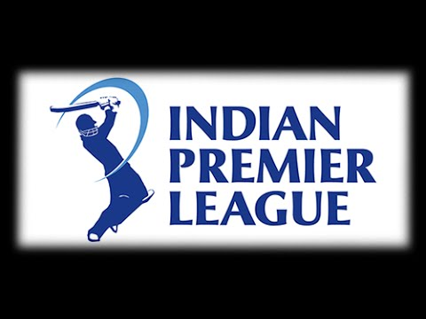
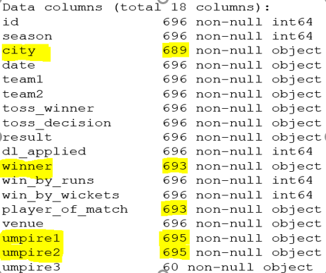
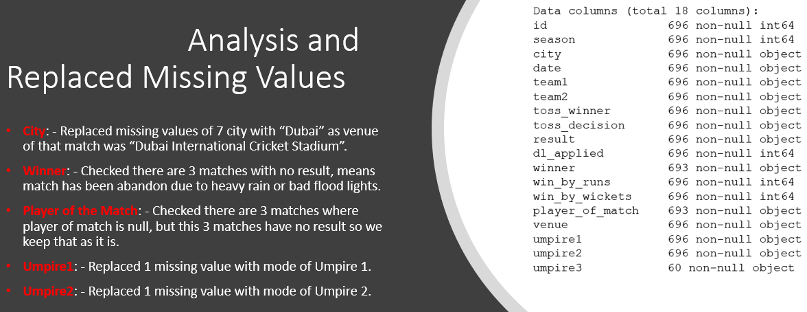

# EDA-of-IPL-Matches

## INTRODUCTION
Every year a lot of companies hire a number of employees. The companies __invest__ time and money in __training__ those employees, not just this but there are __training programs__ within the companies for their existing employees as well. The __aim__ of these programs is to __increase the effectiveness__ of their employees. 
- But where __HR Analytics__ fit in this? 
- and is it just about __improving__ the performance of employees?

## DATA
| Column Name | Description |
| --- | --- |
| `Id` | Numerical Value |
| `Season` | Numerical Value |
| `City` | Cities (where match has played: - 'Hyderabad', 'Pune', 'Rajkot', 'Indore', 'Bangalore', 'Mumbai', 'Kolkata', 'Delhi', 'Chandigarh', 'Kanpur', 'Jaipur', 'Chennai', 'Cape Town', 'Port Elizabeth', 'Durban', 'Centurion', 'East London', 'Johannesburg', 'Kimberley', 'Bloemfontein', 'Ahmedabad', 'Cuttack', 'Nagpur', 'Dharamsala', 'Kochi', 'Visakhapatnam', 'Raipur', 'Ranchi', 'Abu Dhabi', 'Sharjah',' Mohali', 'Bengaluru') |
| `Date` | DATE (on which date match played) |
| `Team`| team1 and team2 are two columns between match played|
| `Toss Winner` | (team name who won the toss) |
| `Toss Decision` | (decision what caption decides after winning the toss) |
| `Result` | (Result of Match whether it’s normal, tie or no result) |
| `DL Applied` | (0=NO, 1=YES) |
| `Winner` | (team name who won the match) |
| `Win by runs` | (by how many runs team won the match) |
| `Win by wickets` | (by how many wickets team won the match) |
| `Player of Match` | (which player contributes more for team) |
| `Venue` | (stadium name where match was played) |
| `Umpire 1` | (umpire 1 name – on ground umpire) |
| `Umpire 2` | (umpire 2 name – on ground umpire) |
| `Umpire 3` | (umpire 3 name – TV umpire) |
## PROJECT ANALYSIS
| Description | Analysis |
| --- | --- |
| ipl_data.head |  |
| missing value |  |
| After replacing missing values |  |

### FEATURE IMPORTANCE

- I saw the performance of each team in 11 IPLs (2008-18) and also finding the best player for each team.
- I saw the performance of each team on home ground matches and away matches.

[Jupyter Notebook](./EDA of IPL (2008-2018).ipynb)
